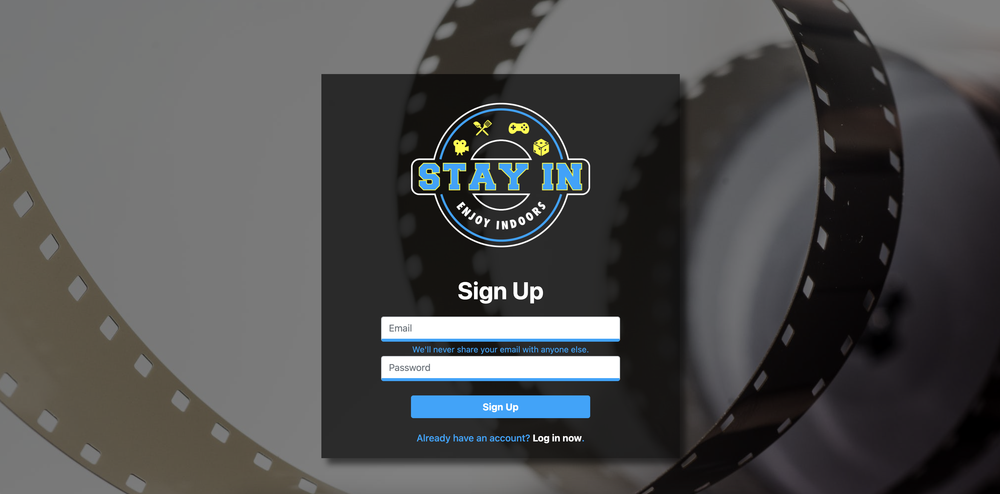

# Stay In App

This is user database app that let's you create update and delete movies from your watchlist. It keeps track of each user's specific watchlist based on their login.

## User Story
* * *
```md
AS A person at home
I WANT a way of keeping track of movies I want to watch
SO THAT I can see a new movie everytime I want to stay in
```

## Instructions
* * *
1) Login or sign up to the Stay In app 
2) Click on the `Watch a Movie` button
3) You can add, update, or delete items from your watch list.

## Link to the deployed application
* * *
[Stay In App](https://stayingin.herokuapp.com/)

## Screenshots
* * *
The Login/Signup Page:


The Welcome Page:


The Movie Page:


The Modal Window for Searching Movies:


The Modal Window for Viewing Watchlist:


## Challenges Faced
* * *
Finding a way to connect the database and routes to each page using Handlebars with Sequelize proved to be very challenging, especially when it also involved adding the The Movie DB API into the mix on the Movie section.

## Future Development
* * *
Our plans for future development of this project is to implement more activities like board games, video games, and cooking and add API calls to each of those new sections. We also would like to eventually add an option that randomly decides between the four options (boardgames, cooking, movies, videogames) for the user to enjoy.

## Technologies Used
* * *
- HTML
- CSS
- Bootstrap
- Javascript
- Sequelize
- Heroku
- Github
- Git
- Express
- PassportJS
- FontAwesome
- MySQL
- Travis CLI
- ESLint
- JQuery
- Honeybadger.io

## Built With
* * *
- [Bootstrap CSS](https://getbootstrap.com/)
- [FontAwesome](https://fontawesome.com/)
- [Handlebars](https://handlebarsjs.com/)
- [JQuery](https://jquery.com/)
- [The Movie DB (API)](https://www.themoviedb.org/)
- [Sequelize](https://sequelize.org/)

## Authors
* * *
* [Caleb Hopkins](https://github.com/calebthecreative)
* [Marshall Bertschy](https://github.com/Marshallb98)
* [Oscar Medina](https://github.com/ogmedina)

## Link to the deployed application
* * *
* [Stay In App](https://stayingin.herokuapp.com/)